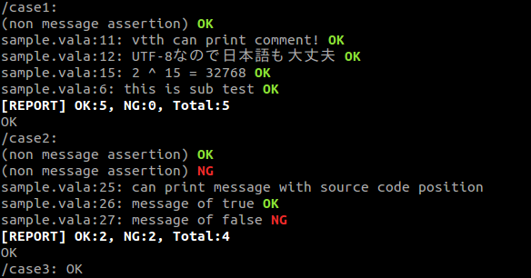

Vtth - Vala tiny testing helper
================================

Vtth is tiny testing helper for vala.

In vala, you can use GLib.Test as testing framework
even if you add no extra library.
But GLib.Test is too simple to enjoy the testing.
Its output has no color, just put 'OK' or abort the program, it is really boring.
So, I improved it a little bit.
Vtth uses GLib.Test as usual, namely this is not new testing framework.

Features of vtth are as follows:

  - Colored OK or NG are output at each assertion.
  - You can select actions at the assertion failed,
    wheter to abort or continue the program.
  - The simple (one line) report which contained counts of OK, NG and
    total of these is output.
  - Methods and parameters related the test case can be grouped into a class.



How to use
-----------

The entire code used in this description is file 'sample.vala' in this repository.

### Building and running a sample

``` sh
make
make check
```


### Writhing test cases

At first, set to use namespace 'Vtth'.

```vala
using Vtth;
```

Each test case is inherited from AbstractTestCase
and test code is written in it.

```vala
class SampleTestCase1 : AbstractTestCase {
	private void sub_test() {
		assert(true, "this is sub test");
	}

	public SampleTestCase1() {
		assert(true);
		assert(true, "vtth can print comment!");
		assert(true, "UTF-8なので日本語も大丈夫");

		uint x = 1 << 15;
		assert(x == 32768, "2 ^ 15 = %u", x);

		sub_test();
	}
}
```

The class `SampleTestCase1` is a test case.
And its test code is written into constructor of this class.
The function `assert` is overridden by AbstractTestCase.
So, the `assert` in this code is executed `AbstractTestCase.assert`.

`AbstractTestCase.assert` has variable arguments.
The first argument is assertion as boolean.
The second argument is message of assertion which is string of printf format.
And the third or later arguments are parameters of the second argument.
Since the character encoding is UTF-8 as vala's default,
it is able to print multi language strings, of course.

The private method `sub\_test` in `SampleTestCase1` is related test of the test case.
As vtth can write test case into one class,
you can group methods to start up or tear down test case and etc. into same class.


### Not abort when assertion failed

```vala
class SampleTestCase2 : AbstractNonStopTestCase {
	public SampleTestCase2() {
		assert(true);
		assert(false);
		message("can print message with source code position");
		assert(true, "message of true");
		assert(false, "message of false");
	}
}
```

If you defined the test case inherited from AbstractNonStopTestCase
instead of AbstractTestCase, this test case doesn't abort even if assertion failed.
The program is usually aborted at the line of `assert(false)`.
However, in this case, the program is not aborted, outputs 'NG' and continues the process.

By the way, the `message` function in this code outputs message
with the source file name and the line.
The message of its argument is printf format.


### Adding the test case into the testing framework

```vala
static int main(string[] args) {
	Test.init(ref args);

	Test.add_func("/case1", () => { new SampleTestCase1(); });
	Test.add_func("/case2", () => { new SampleTestCase2(); });
	Test.add_func("/case3", () => { assert(true); });

	return Test.run();
}
```

Test case is added by GLib.Test.add_func, that is ordinary way.
The add_func's argument which should be passed a delegate for testing
is just doing that new instance of the test case class.


### Compiling

```
valac sample.vala vtth.vala
```

Vtth is not library (package), so copy file 'vtth.vala' into your project
and compile with your code.


### Running the test

The compiled program outputs the result of the test to a stdout.

If a stdout is a tty (terminal screen), the program outputs colored messages.
However, if a stdout is redirected, these messages have no color,
in other words, do not output escape sequence.

This feature is useful if you want to work with other programs by using pipe.
For example, when extracting 'NG' assertions, execute the following command:

```sh
./sample | grep NG$
```

In addition, you can use also Quickfix of vim.
Type the follow command in vim's command line:

```
:make check
```
(See also the Makefile.)


License and copyright
----------------------

This program is licensed under the MIT License.

Copyright(c) 2014 Yusuke Ishida.

